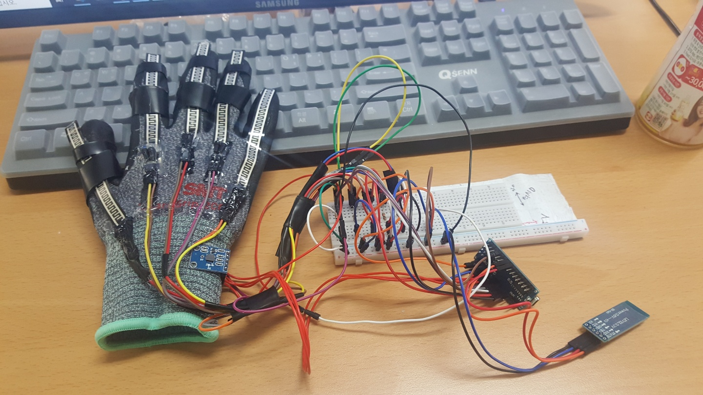
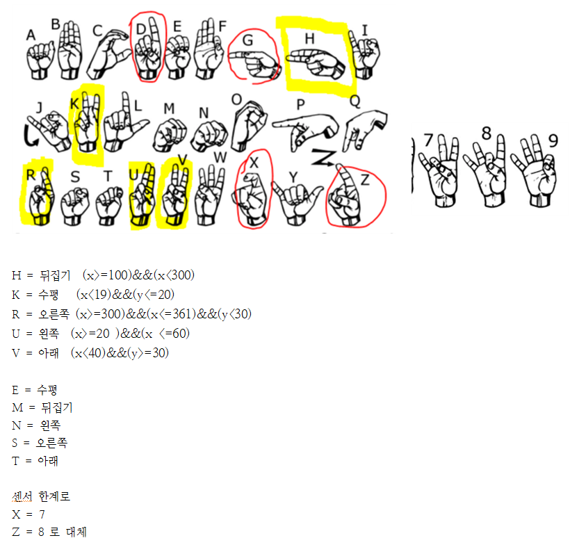
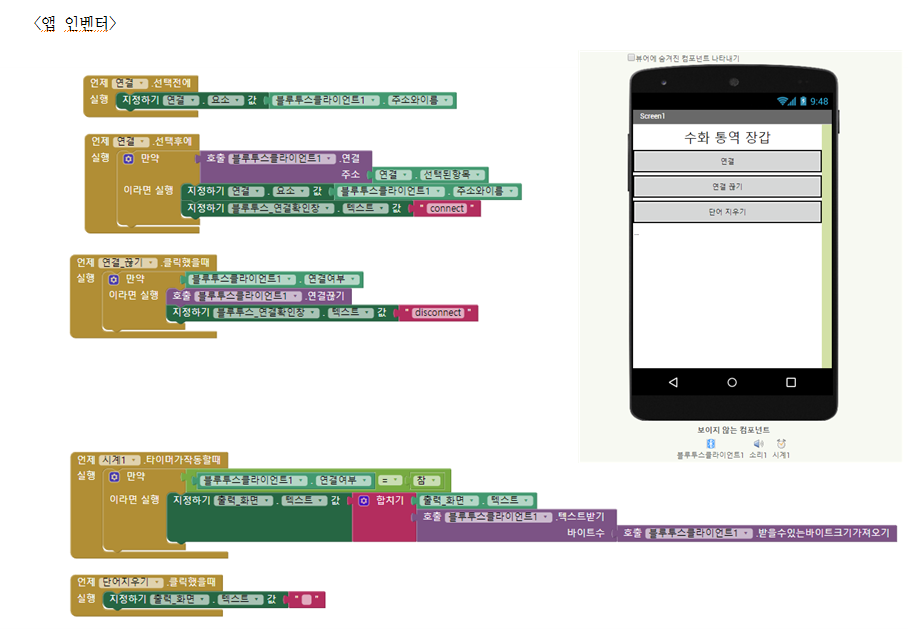

# Arduino_Sign-language-interpreter-gloves

## 수화 통역 장갑
> 간단한 알파벳 수화를 통역하는 장갑

1. 앱 인벤터로 블루투스를 연결한다.
2. 연결되면 장갑은 수화를 인식한다.
3. 플렉스 센서와 각도센서가 값을 동시에 보낸다. 
4. 어떤 동작이 인식되면, 값에 맞는 기호(또는 문자)를 출력한다.
5. 아두이노 나노와 블루투스 모듈을 통해 앱으로 값이 전달되어 출력된다.
6. 문자가 많이 쌓이면 앱 내의 버튼으로 문자를 지워줄 수 있다. 

### 플렉스 센서 구분의 한계 

### 앱 인벤터 

- 연결 버튼을 누르면 블루투스를 검색한다. 
- 연결되면 연결 확인창에 “connect” 라고 나타난다. 
- 연결 끊기 버튼을 누르면 블루투스 연결을 끊는다.
- 연결이 끊기면 확인창에 “disconnect” 라고 나타난다.
- 단어 지우기 버튼을 누르면 출력되는 값을 초기화 시켜 지울 수 있다.
- 출력 화면에는 타이머가 작동하여 계속 나노에서 받은 값을 정리하여 출력해준다.

### 참고 자료 

https://create.arduino.cc/projecthub/173799/a-glove-that-translate-sign-language-into-text-and-speech-c91b13?ref=platform&ref_id=424_trending___&offset=176

https://blog.naver.com/kids_power/221368327344

https://www.youtube.com/watch?v=8dmfe639DxA

https://www.youtube.com/watch?v=Bokp5I6QYBI
